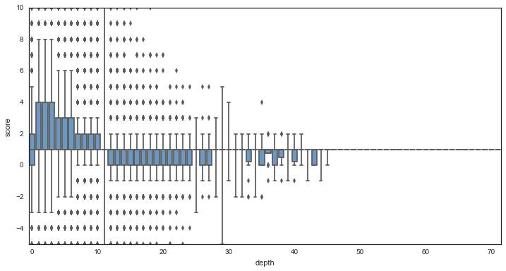

# Reddit Comments May 2015

This is a short exploratory analysis of comments posted on the [www.reddit.com](https://www.reddit.com) website during the month of May 2015.  The data can be retrieved here from [www.kaggle.com](https://www.kaggle.com/reddit/reddit-comments-may-2015).  I used the pandas and sklearn Python packages for data management and analysis.  For figures, I used matplotlib and seaborn.  In the exploration I determined which subreddits were the most commented during the month of May.  I produced statistics regarding various attributes of comments (flair, edits, gold, etc.).  I also looked at comments that had received Reddit Gold, and compared them with the general population of comments.  For the subreddit /r/thebutton, I used text mining to build a predictive model that was able to forecast whether or not somebody pushed The Button, based on the body of a comment.  I also took a quick look at /r/worldnews hoping to find correlations among comment age, comment score, and the depth of a comment.  Finally, I produced a few wordclouds using comment text for /r/worldnews on various days.


## Simple Statistics

Which subreddits had the most comments in May 2015?  A simple SQL query shows /r/AskReddit is the leader by a far margin, followed by various subreddits including a few video game related subreddits.

```SQL
SELECT subreddit, COUNT(subreddit) AS cnt
FROM May2015 GROUP BY subreddit;
```


Of the 50,138 subreddits, the top 20 most commented subreddits account for 14,688,182 of the 54,504,410 total comments, or 27%. 

With over 50 million comments, site-wide statistics are slow to produce on a machine with limited RAM.  Some other interesting statistics include:
* 33.9% of all comments contained author flair (an image or tagline associated with the author's name)
* 0.8% of all comments were authored by ‘distinguished’ individuals ('special', 'admin', 'moderator', etc.)
* 3.1% of all comments had been edited before the time of data retrieval
* 0.03% of all comments were gilded (awarded by another user that purchased Reddit Gold)

To reduce the burden on RAM, we'll be looking at subsets of the data from here on.


## Gilded comments

##### Thank you stranger

As mentioned above, gilded comments are rare (0.03% of all comments).  Of those comments that received gold, 28.7% had also been editted.  The prevalence of edits in gilded comments are attributed, in part, by Thank You messages to the gold giver.  Indeed, "Thank" was found in 17% of all gilded comments, and in half of all edited+gilded comments.  For example,

    “You can't leave Mouse out!  
    Edit: gold?  Awesome thank you!”


    “CHICAGO PIZZA > NY PIZZA  
    edit: thanks for the gold kind stranger!”

##### Have an upvote

The distribution of scores is significantly different for the gilded comments than the entire population of comments.  Below is the distribution of comment scores for all gilded comments in May, along with an equal-sized distribution of comment scores randomly drawn from the general population of comments.


Gilded comments have scores with mean = 536, std = 1062 compared to all comments with mean = 6, std = 48.  Interestingly, commetns with largely negative scores also received gold, indicating people will reward controversial content as well.

##### Gold and subreddits

Not unexpectedly, The most gilded subreddits overlap with the most popular subreddits of May.  Eight of the most gilded subreddits do not appear in the list of top commented, including:

> /r/promos, /r/gifs, /r/baseball, /r/IAmA, /r/thebutton, /r/tifu, /r/gaming, /r/politics.

whereas the following top subreddits are proportionally under-gilded:

> /r/pcmasterrace, /r/DestinyTheGame, /r/soccer, /r/DotA2, /r/GlobalOffensive, /r/hockey, /r/movies, /r/SquaredCircle.  

##### TL;DR

The mean length of a gilded comment’s body is 629 characters (4.5 times the length of a tweet on Twitter).  Compare this with the mean length of comment bodies from 10,000 comments drawn from the general population, 147.  Longer comments have a higher gilding rate than shorter comments.


## /r/thebutton

[The Button](https://www.reddit.com/r/thebutton) was a meta-game and social experiment hosted by Reddit that featured an online button and countdown timer that would reset each time the button was pressed. The experiment was hosted on the social networking website Reddit beginning on April 1 and was active until June 5, 2015, ending with over 1 million button clicks. [https://en.wikipedia.org/wiki/The_Button_(Reddit)](https://en.wikipedia.org/wiki/The_Button_(Reddit))


##### The vocal minority

Let's look at the comment frequency of authors.  Of the 135,670 comments in /r/thebutton, there were 43,618 unique authors, plus 10,875 comments where the author was unknown ([deleted] comments).  Ignoring the [deleted] comments, the distribution of comment count per author looks like


Most authors have relatively few comments, but several have an extraordinary number of comments.  To determine how much these vocal individuals contribute to the entire comment count, I've plotted the cumulative total comments, as a function of increasing author comment frequency.


##### 37 pieces of flair minimum

Users were only allowed a single press of the button, and only users registered before April 1 could participate. Upon clicking, the button timer was reset to 60s, and flair was awarded to the individual who pressed the button.  Flair wass assigned based on how many seconds were left on the timer when the button was pressed:

| Time Clicked      | Color  |
| ------------      | -----  |
| 60s-52s           | Purple |
| 51s-42s           | Blue   |     
| 41s-32s           | Green  |    
| 31s-22s           | Yellow |  
| 21s-12s           | Orange | 
| 11s-0s            | Red    |
| Did not click     | Gray   |
| Not able to click | White  |
| Cheater           | Purple |

Next, I've plotted the distribution of flair types awarded.  As we've seen, authors can have many comments.  I've selected the most recent comment of each author for the purposes of analyzing flair distribution.  I'm also ignoring [deleted] account which have missing values for flair.


Next, I’ve plotted the distribution of click times as reported in the flair (ignoring values of "cheaters").


We see peaks at times around when a new flair color first becomes available.  There is a peak at 0s <= t <= 3s, where users are trying to keep the timer alive.  There is also a strong peak at t = 42s.  As this time does not reward a new color, this particular number must [have some meaning](https://en.wikipedia.org/wiki/Phrases_from_The_Hitchhiker%27s_Guide_to_the_Galaxy#Answer_to_the_Ultimate_Question_of_Life.2C_the_Universe.2C_and_Everything_.2842.29).  By far though, the most common click time among vocal reddit users was t=60s.


##### Filthy non pressers

Hypothetical: If the display of user flair was disabled in /r/thebutton, could we predict what flair a user was given based on the body of their comment?  We can use supervised learning to build a model to predict flair.  In doing so we aim to see if the body of a comment has correlations with the flair assigned to a particular user.

First, I've cleaned the data by removing comments with missing values for flair type (including [deleted] authors).  Additionally, to prevent bias on the most vocal of users, we only keep comments from users with less than 10 total comments in the population.  These cuts yield a total of 73,427 comments to work with.  Each comment body in the corpus was vectorized by TF-IDF.  Words required a minimum document occurence of 5. Bigrams were produced in addition to individual words.  I also excluded common stop words.

I started with a simple model, classifying comments as either pressed (flair = "press-X") or has not pressed (flair = "no-press").  Reducing the number of classes simplifies the model and also increases the number of training points in each class.  A random subset of the data was held out as a validation set, with the remaining comments used for training.  I fit a simple logistic regression model on the training set, yielding an accuracy score on the validation set, acc = 0.630, and an ROC area-under-the-curve, AUC = 0.670.


Although not very strong, there is some predictive power, allowing the separation of pressers and non-pressers, based entirely on the contents of a comment.  The most important features, having the largest coefficients include (from strongest to less strong):

    filthy non, grey, shade, towel, waited, orange, day presser, regrets, 
    pure, 60s, remain, yellow, wanted, tempted, lucky, team60s, presser, 
    just pressed, clicked, signed, felt, stay, green, pressers, regret, 
    temptation, filthy pressers, red, lurking, strong


In the hopes of improving the model, I fit a gradient boosting classifier model to the training set.  Because of the large number of features, I first reduced the dimensionality of the features from over 9000 down to 500 using TruncatedSVD.  Parameters used in the boosting classifer are: a learning rate = 0.1, max tree depth = 3, and sub-sampling = 0.75.  After 50 iterations, the resulting validation accuracy and ROC AUC are 0.627 and 0.650, respectively.  The logistic model outperformed the gradient boosting classifier (although extensive parameter tuning and longer runtime could improve the boosting classifier).

Going further, we now look at a model that attempts to recover the flair color of a comment.  Here, only comments from pressers are considered (flair_css_class = "press-X").  A logistic regression yields an accuracy = 0.43, and the following confusion matrix:

|         | press-6 | press-5 | press-4 | press-3 | press-2 | press-1 |
| ------- | ------- | ------- | ------- | ------- | ------- | ------- |
| press-6 | 2823    |    10   |     3   |     4   |     9   |   660   |
| press-5 | 670     |   36    |    4    |    1    |    5    |  196    |
| press-4 | 427     |    3    |  50     |    4    |    1    |  137    |
| press-3 | 505     |    0    |    3    |   57    |    9    |  169    |
| press-2 | 666     |    4    |    2    |    0    |   94    |  280    |
| press-1 | 841     |    2    |    4    |    3    |    7    | 1192    |

Given the model choice and feature choice, there is poor predicting power of the model to determine which color flair was given to a user, based on their comments.


# /r/worldnews

I briefly took a look at comments in /r/worldnews.  I wanted to engineer new features from the limited data set. For the first feature, I calculated the age of a comment at the time of data retrieval using age = retrieved_on – created_utc.  The distribution of ages is illustrated here.


The second feature I engineered is comment depth.  Using the parent_id for each comment, I was able to recursively trace the comment hierarchy to determine how many parent comments lie between the given comment and the original thread post.  Top-level comments were assigned depth = 0, and child comments had depth incremented by 1 per level.


I wanted to see if either of these two features are correlated to the comment score.  The distribution of comment scores in /r/worldnews is shown below.  The scores have a median = 1, and the first and third quartiles sit at score = 1 and score = 3.  Indeed, 90% of comment scores in this subreddit fall between -4 and 20.  Although scores can reach very large numbers, these high-scoring comments occur rarely.


Below I've plotted the average comment score as a function of age (in days).  Bars represent the range containing 95% of comments.  There appears to be no correlation with score and comment age (r = -0.001).


We see slightly more correlation with between score and comment depth (r = -0.065 when using log-score), but the correlation remains low, given the small range in values for the majority of comments.


Using box plots, we can see, more clearly, that the scores are sharply centered around small values, and it is the outliers that are driving the correlation of score and comment depth.



Finally, to get a pulse of the comment section of /r/worldnews, I produced some word clouds created from the comments of a few different days of the month of May.

2015-05-04


2015-05-13


2015-05-18


2015-05-29

